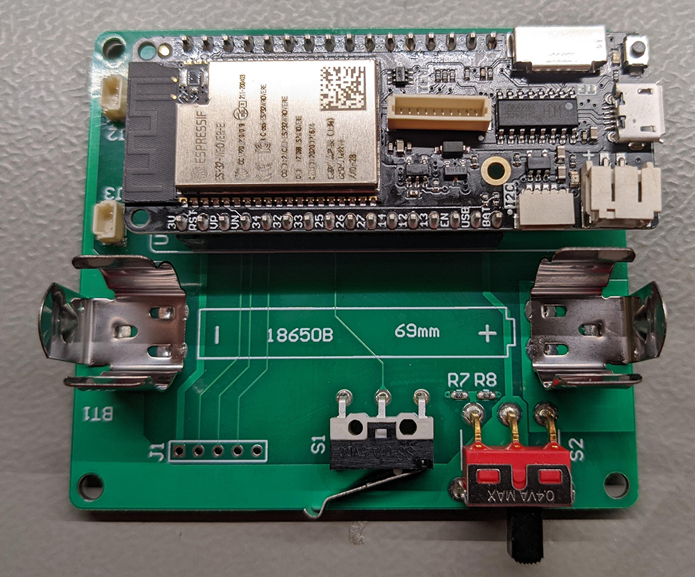
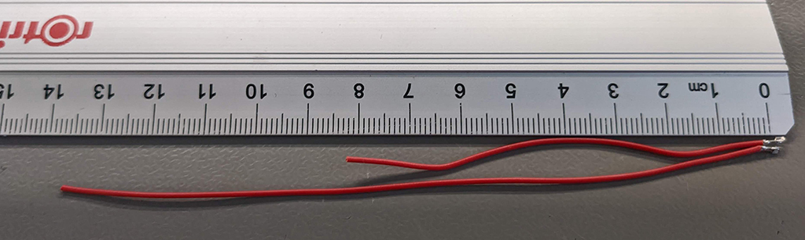
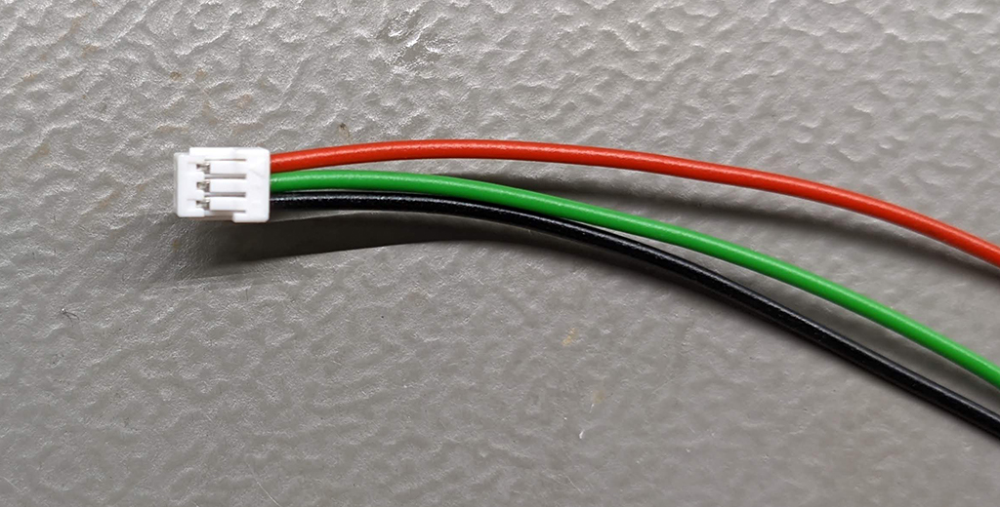
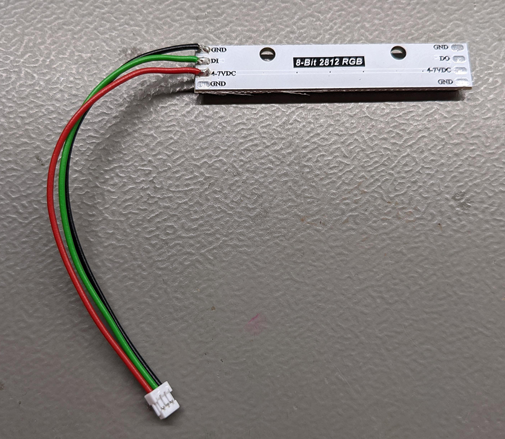

# Assembly of the TallyLight

## BOM
* TallyLight board, see [electronics](../eletronics/) section
* Chassis (4 parts), see [cad](../cad/) section
* Lolin D32 Pro (https://www.bastelgarage.ch/lolin-d32-pro-esp32-board-16mb-flash-8mb-psram, https://www.wemos.cc/en/latest/d32/d32_pro.html)
* 2x WS2812 8-pixel RGB LED stick (https://www.bastelgarage.ch/neopixel-stick-8x-ws2812-rgb-led)
* NCR18650B LiIon battery with protection electronics (https://www.bastelgarage.ch/li-ion-akku-3-7v-3000ma-ncr18650b-18650-mit-schutzelektronik, http://www.varicore.cn/page95?product_id=94)
* 2x SHR-03V-S connector with terminals or pre-assembled cable

## TallyLight board

## LED sticks and 
Tune the cables to the correct length. The two LED strips have different length.

Assemble the SHR-03V-S connector

Solder the cable to the LED stripo
